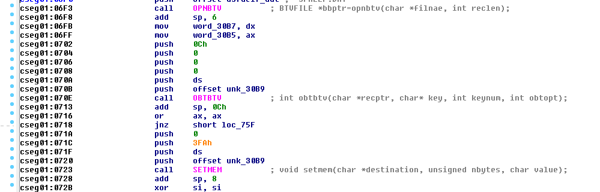
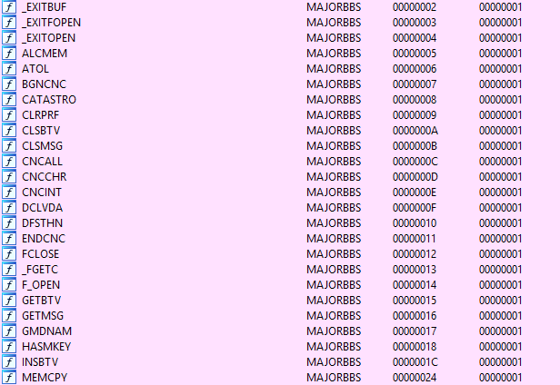

# MBBSDASM.IDA

**MBBSDASM.IDA** is a collection of [Hex-Rays IDA](https://www.hex-rays.com/products/ida) IDS/IDT files that allow Hex-Rays IDA Disassembler to properly identify/label imported functions in MajorBBS/Worldgroup modules.

These import definitions are modified versions of the more in-depth definitions available through [MBBSDASM](https://github.com/enusbaum/MBBSDASM). Everyone has their preferred reverse engineering tools, so I wanted to ensure folks who prefer
to use Hex-Rays IDA for their disassembly can take advantage of all the research that has gone into better understanding GALACTICOMM MajorBBS/Worldgroup modules.

# INSTALLATION

Copy the provided **.IDT** files in this repo into your Hex-Rays IDA Installation "IDS" folder (Example: **"C:\Program Files (x86)\IDA 6.8\ids\"**)

After the files are in place, IDA will now properly identify all imports from both MAJORBBS and GALGSBL for any MajorBBS/Worldgroup module.

# Limitations

The current version of these files only properly identifies the imports and comments them. For more in-depth commenting, method signature resolution, C/C++ decompilation, and debugging information please use [MBBSDASM](https://github.com/enusbaum/MBBSDASM).

With future versions, I'll work on implementing as much as I can within the ability of the IDA IDS/IDT spec,

# License

**MBBSDASM.IDA** is licensed under The Unlicence. So go bananas!
